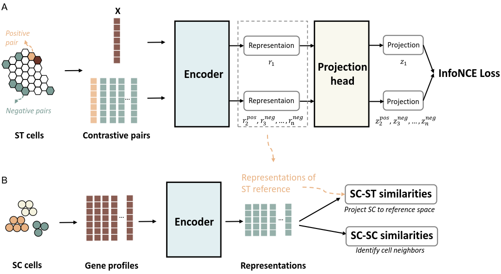

# CellContrast

# CellContrast: Reconstructing Spatial Relationships in Single-Cell RNA Sequencing Data via Deep Contrastive Learning

[](https://opensource.org/license/mit/) 

Contact: Yuanhua Huang, Ruibang Luo, Shumin Li

Email:  yuanhua@hku.hk, rbluo@cs.hku.hk, lishumin@connect.hku.hk

## Introduction

CellContrast reconstructs the spatial relationships for single-cell RNA sequencing (SC) data. Its fundamental assumption is that gene expression profiles can be projected into a latent space, where physically proximate 
cells demonstrate higher similarities. To achieve this, cellContrast employs a contrastive learning framework of an encoder-projector structure. The model was trained with spatial transcriptomics (ST) data and applied to SC data for obtaining the spatially-related representations. The produced results of cellContrast can be used in multiple down-stream tasks that requires spatial information, such as cell-type co-localization and cell-cell communications.



---


## Contents

- [Latest Updates](#latest-updates)
- [Installations](#installation)
- [Usage](#usage)
    - [Model training](#model-training)
    - [Performance evaluation](#performance-evaluation)
    - [Spatial inference](#spatial-inference)
   

## Latest Updates
* v0.1 (Sep, 2023): Initial release.
---
## Installation
To install CellContrast, python 3.9 is required and follow the instruction
1. Install <a href="https://docs.conda.io/projects/miniconda/en/latest/" target="_blank">Miniconda3</a> if not already available.
2. Clone this repository:
```bash
  git clone https://github.com/HKU-BAL/CellContrast
```
3. Navigate to `CellContrast` directory:
```bash
  cd CellContrast
```
4. (5-10 minutes) Create a conda environment with the required dependencies:
```bash
  conda env create -f environment.yml
```

5. Activate the `cellContrast` environment you just created:
```bash
  conda activate cellContrast
``` 


## Usage


CellContrast contains 3 main moduels: train, eval and inference, for training model, benchmarking evaluation and inference of spatial relationships, respectively. To check available modules, run:

```bash
 
 python cellContrast.py -h
 
```
### Model training
CellContrast model was trained based on ST data (which should be in [AnnData](https://anndata.readthedocs.io/en/latest/) format, with truth locations in .obs[['x','y']]). The model can be trained with the following command:
```bash

python cellContrast.py train \
--train_data_path   train_ST.h5ad \ ## required, use your ST h5ad file here
--save_folder cellContrast_models/  \ ## optional, model output path
--parameter_file parameters.json ## optional. use the default or your customized parameters here

## Output file: cellContrast_models/epoch_3000.pt
```

### Performance evaluation
The peformance of benchmarking can be evaluated with the following command, and three metrics are included: nearest neighbor hit, Jessen-Shannon distance, and Spearman's rank correlation.

```bash
python cellContrast.py eval \
--ref_data_path   ref_ST.h5ad \          ## path of refernece ST h5ad file
--query_data_path query_ST.h5ad \        ## path of testing h5ad file with truth locations
--model_foldercellContrast_models\ ## folder of trained model
--parameter_file parameters.json \ ## parameters of trained model
--save_path results.csv \ ## evaluation result path

## Output file: result.csv with neighbor hit, JSD, spearman's rank correlation for each testing sample.


```

### Spatial inference
The spatial relationships of SC data can be obtained with the following command:
```bash
python cellContrast.py inference \
--ref_data_path   train_ST.h5ad \ ## path of refernece ST h5ad file
--query_data_path query_sc.h5ad \ ## path of query SC h5ad file 
--model_folder \                     ## folder of trained model
--parameter_file parameters.json \ ## uparameters of trained model
--save_path spatial_reconstructed_sc.h5ad \ ## path of of the spatial reconstructed SC data

## Output file: spatially reconstructed h5ad file of annData, with pairwise cosine similarities of inferred representations, referenced coordinates, and de novo coordinates in uns.
```


